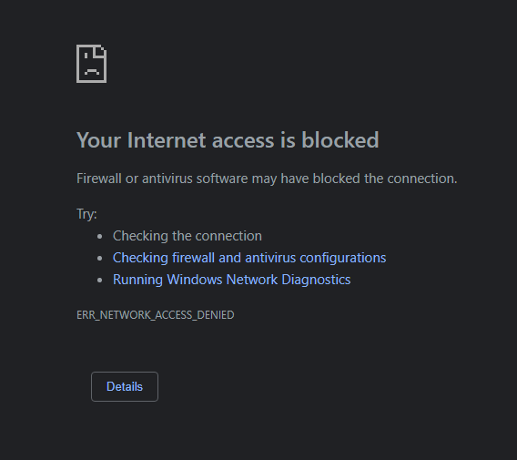
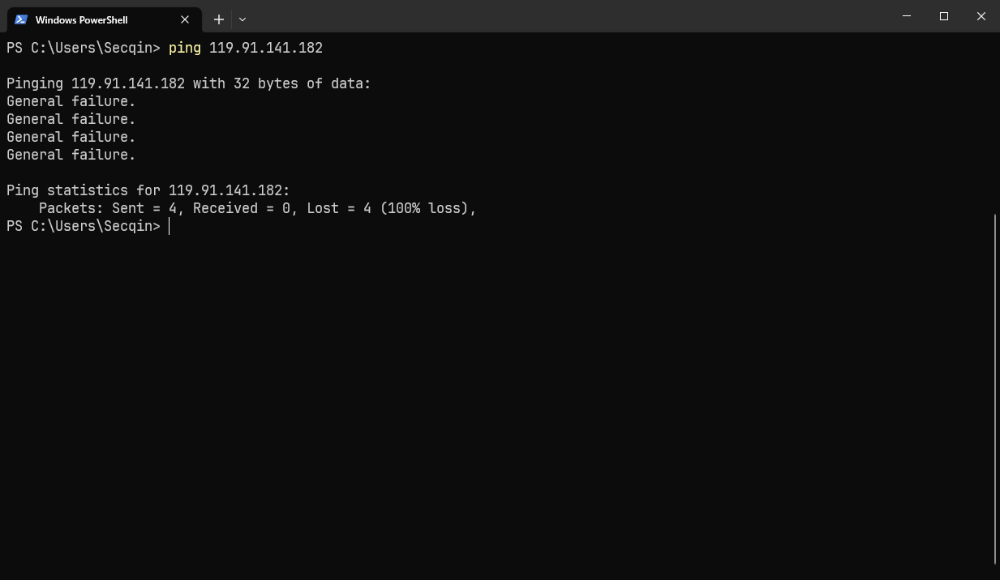
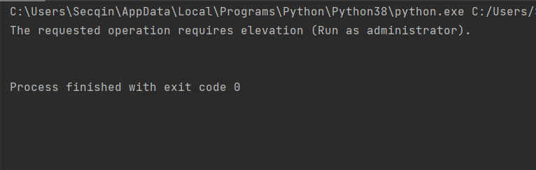

# 介绍
- 断开校园网
- 对防火墙添加规则 禁止访问校园网IP进行联网操作

## 断开校园网
- 判断当前是否联网
- 强制注销校园网

## 添加防火墙规则 （需要管理员权限运行）
- 禁止访问172.17.0.1
- 在程序关闭时，清空规则，恢复默认设置

# 打包可执行文件
- pyinstaller -F -w main.py
- /dist/main.exe
- 防火墙部分需要给可执行文件才能执行

